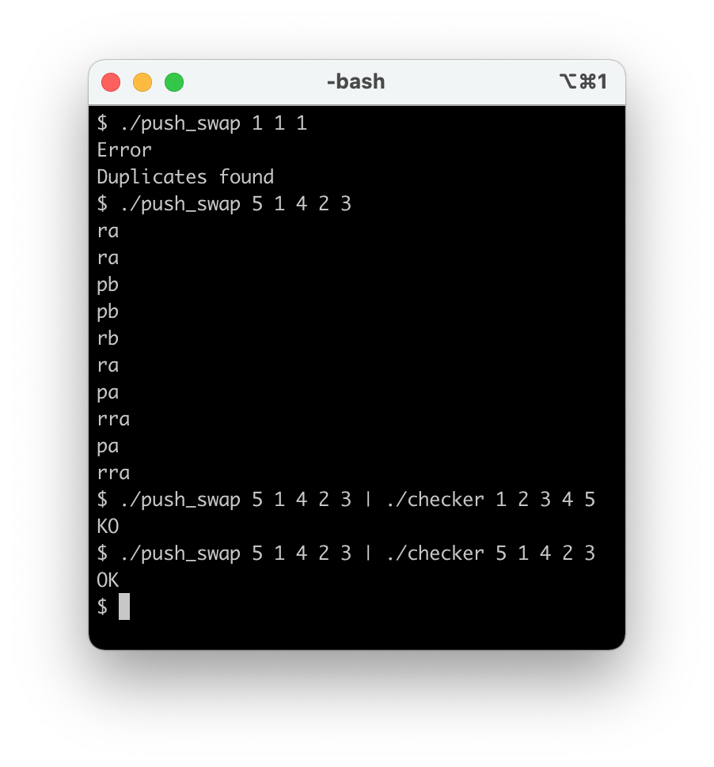

# push_swap


A program that sorts data on a stack, with a limited set of instructions, using
the lowest possible number of actions



## Description

* You have 2 stacks named a and b.
* At the beginning:
  * The stack a contains a random amount of negative and/or positive numbers which cannot be duplicated.
  * The stack b is empty.
* The goal is to sort in ascending order numbers into stack a. To do so you have the
following operations at your disposal:

| Operation                 | Description                                                                                       |
|:-------------------------:|:-------------------------------------------------------------------------------------------------:|
| sa (swap a)               | Swap the first 2 elements at the top of stack a. Do nothing if there is only one or no elements.  |
| sb (swap b)               | Swap the first 2 elements at the top of stack b. Do nothing if there is only one or no elements.  |
| ss                        | sa and sb at the same time.                                                                       |
| pa (push a)               | Take the first element at the top of b and put it at the top of a. Do nothing if b is empty.      |
| pb (push b)               | Take the first element at the top of a and put it at the top of b. Do nothing if a is empty.      |
| ra (rotate a)             | Shift up all elements of stack a by 1. The first element becomes the last one.                    |
| rb (rotate b)             | Shift up all elements of stack b by 1. The first element becomes the last one.                    |
| rr                        | ra and rb at the same time.                                                                       |
| rra (reverse rotate a)    | Shift down all elements of stack a by 1. The last element becomes the first one.                  |
| rrb (reverse rotate b)    | Shift down all elements of stack b by 1. The last element becomes the first one.                  |
| rrr                       | rra and rrb at the same time.                                                                     |

## Compile

| Command    | Compiles  |
|:----------:|:---------:|
| make       | push_swap |
| make bonus | checker   |

## Run push_swap

```
./push_swap 9 4 8 7 1 3 6 2 5
```

it will produce the least operations required to sort the stack

## Run checker

```
./push_swap 9 4 8 7 1 3 6 2 5 | ./checker 9 4 8 7 1 3 6 2 5
```

it will check that produced operations are sorting the stack correctly

## push_swap visualiser

pyviz.py is a push_swap visualiser and it was taken from:
https://github.com/o-reo/push_swap_visualizer

To use pyviz.py first compile push_swap and use:
```
python3 pyviz.py `ruby -e "puts (-200..200).to_a.shuffle.join(' ')"`
```

